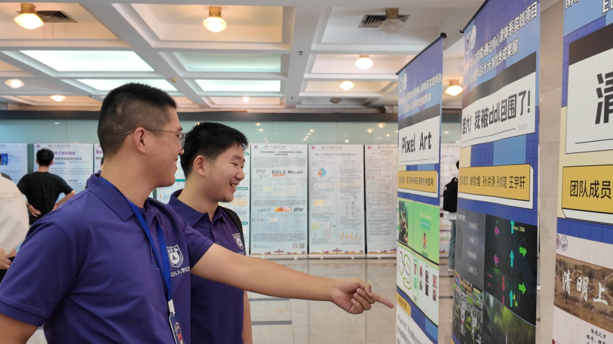

<link rel="stylesheet" href="assets/styles/global.css">

# 中文版本（Chinese version）

## 你好 👋

我是南京大学软件工程专业的一名本科学生。能力有限，请多担待。

可以通过邮件联系我：[231250084@smail.nju.edu.cn](mailto:231250084@smail.nju.edu.cn)

## 最近动态

我将担任软件学院《计算机系统基础实验》（ ICS-PA ）课程的助教（ 2026 秋季学期）。欢迎大家选课~

我撰写了一篇关于《计算机系统基础》课程的[学习手册](https://smewin.github.io/cs/ics_riscv/)，欢迎大家不吝赐教。

我制作了一个[小蓝鲸学业规划助手](http://139.224.37.73/schedule)，供软件工程专业 2025 培养方案的同学使用。

## 过往奖项

- 南京大学软件学院 2025 BingoC 代码大赛高年级组特等奖
- 南京大学 2024 EL 程序设计大赛交互组二等奖
（感谢大家喜欢我们的作品~）
- 南京大学软件学院 2023 代码达阵比赛三等奖
- 人民奖学金

## 业余爱好

代码是工作，爱好是生活~

专业之外，我的业余研究爱好为：基于建构大学文化方式的高-大衔接与个人成长；基于跨学科思维的个人社会心理认知。

# English Version

## Hi there 👋

I am an undergraduate student in Software Engineering at Nanjing University. My abilities are limited, so please bear with me.

You can reach me via email: [231250084@smail.nju.edu.cn](mailto:231250084@smail.nju.edu.cn)

## Recent Updates
I will be a teaching assistant for the "Programming Assignment on Introduction to Computer Systems (ICS-PA)" course in the Software Institute (2026 Fall). Welcome to enroll in the course!

I have written a [study guide](https://smewin.github.io/cs/ics_riscv/) for the "Introduction to Computer Systems" course, and I welcome any feedback.

## Past Awards
- Grand Prize in the Senior Group, Nanjing University Software Institute 2025 BingoC Code Competition
- Second Prize in the Interactive Group, Nanjing University 2024 EL Programming Competition  
 (Thank you for liking our work!)
- Third Prize, Nanjing University Software Institute 2023 Code Touchdown Competition
- People's Scholarship

## Hobbies
Coding is work, hobbies are life~  

Outside of my major, my amateur research interests include: high school-university transition and personal growth based on constructing university culture; personal social psychological cognition based on interdisciplinary thinking.

<!--
**VGamerCTroller/VGamerCTroller** is a ✨ _special_ ✨ repository because its `README.md` (this file) appears on your GitHub profile.

Here are some ideas to get you started:

- 🔭 I’m currently working on ...
- 🌱 I’m currently learning ...
- 👯 I’m looking to collaborate on ...
- 🤔 I’m looking for help with ...
- 💬 Ask me about ...
- 📫 How to reach me: ...
- 😄 Pronouns: ...
- ⚡ Fun fact: ...
-->
